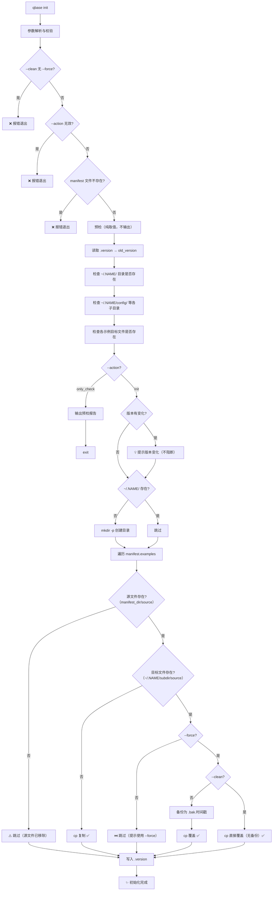

# init/ — qbase 初始化模块

## 设计目标

让 qbase（及其他脚本库）安装后能自动把示例文件放到用户本地目录（`~/.qbase/`），同时给用户一个统一的入口来管理本地数据。未初始化时，直接输入 `qbase` 会提示运行 `qbase init`。

## 文件结构

```
init/
├── qbase_init.sh                   # 通用初始化脚本（可被其他库复用）
├── init_manifest.json              # qbase 的清单文件（声明要创建的目录和复制的示例文件）
└── env_keys_menu.json              # 环境变量集合/菜单的示例文件（复制的 ~/.qbase/config/ 后即为用户配置）
```

### 为什么 init/ 下不嵌套子目录？

当前只有 3 个文件（manifest + 2 个示例），摊开放一目了然。脚本引用路径也更简洁：

```
✓   $(dirname "$0")/example_env_keys_menu.json
✗   $(dirname "$0")/data/example_env_keys_menu.json
```

后续若单项目示例文件超过 10 个，可考虑增设 `data/` 子目录。

## 架构设计

### 通用化设计：为什么保留 `--manifest`

`qbase_init.sh` 是通用脚本，其他库（如 qtool）也可以从 qbase 路径调用它：

```bash
sh /opt/homebrew/Cellar/qbase/0.9.39/bin/init/qbase_init.sh \
    --project-name "qtool" \
    --manifest "/opt/homebrew/Cellar/qtool/.../init/init_manifest.json"
```

如果不传 `--manifest`，脚本会去自己所在目录找 `init_manifest.json`，找到的是 qbase 的，不是 qtool 的。

两种方案的对比：

| 方案 | 做法 | 优点 | 缺点 |
|------|------|------|------|
| **各自复制** | 每个项目 `init/` 下放一份 `qbase_init.sh` | 独立，不依赖 | 更新需逐个改 |
| **中心化 + `--manifest`** | qbase 统一维护脚本，调用方传 manifest | 一次更新到处生效 | 调用方需多传一个参数 |

选择中心化方案的原因：脚本逻辑（备份、版本追踪、check）是所有项目通用的，没必要每个项目维护一份。差异点（要创建什么目录、复制什么文件）由 `init_manifest.json` 表达，脚本只关心 manifest 的结构，不关心内容。

### 版本追踪设计

每次 `qbase init` 成功后将版本号写入 `~/.qbase/.version`。后续运行时对比当前版本和 `.version`：

| .version 状态 | 行为 |
|---------------|------|
| 版本一致 | 不做额外提示 |
| 版本不同 | 💡 提示用户版本有更新，引导使用 `--force` 查看数据结构变化 |
| 不存在 | 首次运行，正常初始化 |

刻意规避的点：**不应该自动覆盖用户文件**。检测到版本变化只提示，让用户决定是否 `--force`。

### `--force` 的备份策略

```
--force 覆盖前备份为 .bak.YYYY-MM-DD.HHMMSS（精确到秒）
```

保证：
1. 多次 `--force` 不会互相覆盖备份（时间戳不同）
2. 用户能按时间排序找到最新的备份
3. 配合 diff 提示方便对照数据结构变化

### 文件来源的优先级

`env_var_1get_by_manual.sh` 加载示例文件时的查找顺序：

```
1. ~/.qbase/config/example_env_keys_menu.json   ← 用户本地副本（优先）
2. {安装目录}/init/example_env_keys_menu.json    ← 安装包内置（fallback）
```

这样设计的原因：
- 用户改了本地副本，不会被 brew upgrade 覆盖
- 用户误删本地副本，自动回退到内置版本

## 流程图



## 参数说明

| 参数 | 必填 | 说明 |
|------|------|------|
| `--project-name NAME` | 是 | 决定 `~/.NAME/` 目录 |
| `--version VERSION` | 是 | 写入 `~/.NAME/.version` |
| `--manifest PATH` | 是 | 清单 JSON 路径（见架构设计说明） |
| `--action ACTION` | 否 | 执行动作：`init`（默认）或 `only_check` |
| `--force` | 否 | 覆盖已有文件（自动备份旧文件） |
| `--force --clean` | 否 | 覆盖不备份 |

> `--clean` 单独使用（无 `--force`）会报错退出。
>
> `--action only_check` 只检查不做写入，不影响现有文件。

## 调用示例

```bash
# qbase 自身（通过 qbase.sh 路由）
qbase init
qbase init --force
qbase init --force --clean
qbase init --action only_check

# 其他库复用（直接调用 qbase_init.sh）
sh /opt/homebrew/Cellar/qbase/0.9.39/bin/init/qbase_init.sh \
    --project-name "qtool" \
    --version "1.2.3" \
    --manifest "/opt/homebrew/Cellar/qtool/1.2.3/bin/init/init_manifest.json"
```

## 新项目接入步骤（供其他库参考）

1. 在项目 `init/` 目录下创建 `init_manifest.json`
2. 把示例文件放入 `init/`（或清单中声明的路径）
3. 在项目入口脚本中调用 `qbase_init.sh` 传入参数
4. 项目各脚本中引用示例文件时，先查 `~/.{project_name}/config/` 再 fallback 到安装目录

## ~/.qbase/ 目录约定

```
~/.qbase/
├── config/     # 用户配置文件（手动创建/修改，持久保留）
├── data/       # 脚本运行产生的数据（自动生成，可长期保留）
├── cache/      # 可丢弃的缓存（删了会自动重新生成）
└── tmp/        # 临时文件（随时可清理）
```

> 备注：XDG Base Directory（`~/.config/`、`~/.local/share/`、`~/.cache/`）是更标准的方案，但 macOS 下不太常用，`~/.qbase/` 更符合 macOS 用户的直觉。各脚本也可通过环境变量覆盖默认路径。
