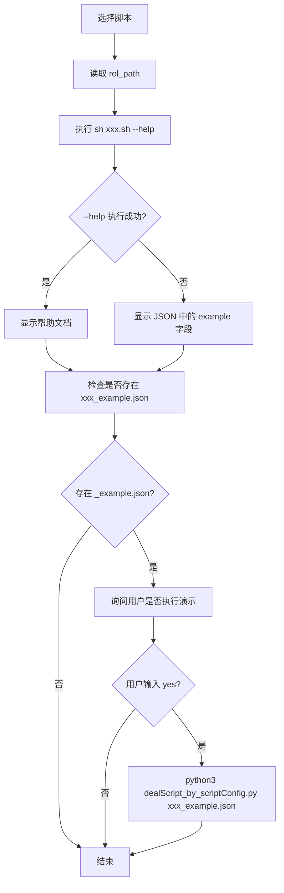

# qbrew_menu.sh

## 功能

- 1、先打印出 JSON文件指定分类为菜单(如qbrew 库中 qbase.json 、 qtool.json 的 support_script_path )，供用户选择。

- 2、再在用户选择后了分类里的事项后，通过 -execChoosed 的参数值决定如何处理。
  - 情况①true:立即执行该事项command字段指定的命令 ；
  - 情况②false:则查看所选事项指定的脚本的使用帮助和执行其演示示例

## 使用方法

```bash
sh xxx.sh -file qbase.json -categoryType support_script_path -execChoosed true
```

### 参数

| 参数 | 说明 | 必填 |
|------|------|------|
| `-file` | 对哪个 json 文件进行操作 | ✅ |
| `-categoryType` | 对该文件的哪个分类进行操作 | ❌ |
| `-execChoosed` | 是否直接执行选中的命令，true:是 | ❌ |


## 一、认识菜单的结构及两种用途

JSON 文件有两种用途：

### 公共结构：

```json
{
    "custom": [
        {
            "type": "这个集合的类型",
            "des": "这个集合的描述",
            "values": [
                {
                    "des": "集合中命令1的 描述",
                    "key": "集合中命令1的 key"
                }
            ]
        }
    ]
}
```

### values 的两种结构：

| 场景        | 自定义命令                         | 脚本帮助                        |
| ----------- | ---------------------------------- | ------------------------------- |
| JSON示例    | `custom_command_menu_example.json` | `qbase.json` / `qtool.json`     |
| execChoosed | `true`                             | `false`（默认）                 |
| 针对的字段  | `values[].command`                 | `values[].rel_path`             |
| 选中后      | 直接执行 command                   | 获取脚本，执行 `脚本.sh --help` |
| 使用场景    | 快捷打开常用目录、命令             | 查看脚本使用方法、执行演示      |

#### 结构一：执行命令

示例： 打印`custom_command_menu_example.json`的 `custom` 分类为菜单后，选择其中的如下选项

```json
{
	"des": "查看 Project 文件",
	"key": "goProject",
	"command": "open ~/Project/"
}
```

使用方式：

```bash
sh qbrew_menu.sh -file custom_command_menu_example.json -categoryType custom -execChoosed true
```

##### 实际内部核心：

```bash
# 自定义命令菜单：qbrew_menu.sh 内部直接 eval 执行 JSON 中的 command
tCatalogOutlineCommand=$(jq -r ".command" "$tCatalogOutlineMap")
eval "${tCatalogOutlineCommand}"
```

#### 结构二：显示脚本帮助

示例：打印`qbase.json` / `qtool.json`的 `support_script_path` 分类为菜单后，选择其中的如下选项

→ 选择 "package_remote_version" → 显示脚本的 --help

```json
{
	"key": "package_remote_version",
	"des": "检查/更新 Homebrew 包的远程版本",
	"rel_path": "./package/package_remote_version.sh",
	"example": "qbase -quick package_remote_version -a check -p qbase -v"
}
```

使用方式：

```bash
sh qbrew_menu.sh -file qbase.json -categoryType support_script_path execChoosed false
```

##### 实际内部核心（show_usage_for_choose 流程）：




`python3 dealScript_by_scriptConfig.py -script-config-file xxx_example.json` 见下文 [演示文件的 JSON](#演示文件的 JSON)


<a name="演示文件的 JSON"></a>

## 二、演示文件的 JSON

用于执行演示示例的配置文件，通过 `dealScript_by_scriptConfig.py` 执行。

### 1、认识 _example.json 结构：

以想要执行以下命令和参数值为例：

```bash
sh qbrew_menu.sh -file xxx -categoryType yyy -execChoosed true
```

可新建 `qbrew_menu_example.json`，并配置如下内容：

```json
{
    "action_sript_file_rel_this_dir": "../qbrew_menu.sh",
    "action_sript_file_des": "打印json文件里的指定的分类为菜单，供用户选择，并在用户选择后了分类里的事项后，立即执行该事项command字段指定的命令",
    "actions_envs_des": "要打印的菜单分类",
    "actions_envs_values": [
        {
            "env_id": "menu_category",
            "env_name": "",
            "env_action_ids": [
                "-file",
                "-categoryType",
                "-execChoosed"
            ]
        }
    ],
    "actions": [
        {
            "id": "-file",
            "des": "对哪个json文件进行操作",
            "actionType": "fixed",
            "resultForParam": "-file",
            "fixedType": "file-path-rel-this-file",
            "fixedValue": "./custom_command_menu_example.json"
        },
        {
            "id": "-categoryType",
            "des": "可选?：对该文件的哪个分类进行操作",
            "actionType": "fixed",
            "resultForParam": "-categoryType",
            "fixedType": "fixed-value",
            "fixedValue": "custom"
        },
        {
            "id": "-execChoosed",
            "des": "可选：是否直接执行选中的命令，true:是",
            "actionType": "fixed",
            "resultForParam": "-execChoosed",
            "fixedType": "fixed-value",
            "fixedValue": "true"
        }
    ]
}
```

### 2、核心调用方式及原理

#### 2.1、核心调用源码

**dealScript_by_scriptConfig.py**： **使用 json 里指定的脚本及该脚本的参数值，执行该执行脚本**

```bash
# 使用 qbrew_menu_example.json 里指定的脚本及该脚本的参数值，执行该执行脚本
python3 ${path}/pythonModuleSrc/dealScript_by_scriptConfig.py -script-config-file qbrew_menu_example.json
```

#### 2.2、原理

dealScript_by_scriptConfig.py 执行流程

```
                         dealScript_by_scriptConfig.py
                                              ↓
                    读取 _example.json 的 actions 配置
                                              ↓
                    组装命令并执行 action_sript_file_rel_this_dir 指向的脚本
```


### 3、字段说明

#### 第一层

| 字段                             | 说明                                       |
| -------------------------------- | ------------------------------------------ |
| `action_sript_file_rel_this_dir` | 要执行脚本的路径（相对于 json 所在目录）   |
| `action_sript_file_des`          | 要执行脚本的描述                           |
| `actions_envs_values`            | 要执行脚本的环境变量有哪些参数             |
| `actions_envs_des`               | 要执行脚本的环境变量大概是什么用途的描述   |
| `actions`                        | 执行时传入的参数（为空时使用脚本默认参数） |

> 与 qbrew_menu.sh 的 JSON 格式不同，这种是给 dealScript_by_scriptConfig.py 用的演示配置文件。

#### 第二层之actions 里

| 字段             | 说明 |
| ---------------- | ---- |
| `id`             |      |
| `des`            |      |
| `actionType`     |      |
| `resultForParam` |      |
| `fixedType`      |      |
| `fixedValue`     |      |

- `actionType`

| 字段                | 说明   |
| ------------------- | ------ |
| `actionType: fixed` | 固定值 |
|                     |        |

- `fixedType`

| 字段                                 | 说明         |
| ------------------------------------ | ------------ |
| `fixedType: file-path-rel-this-file` | 相对路径文件 |
| `fixedType: fixed-value`             | 固定字符串   |

### 4、其他示例

想要执行

```bash
sh value_create_app_version_and_build.sh
```

可新建 `value_create_app_version_and_build_example.json`，并配置如下内容：

```json
{
    "action_sript_file_rel_this_dir": "../value_create_app_version_and_build.sh",
    "action_sript_file_des": "获取给app的版本号和build号",
    "actions_envs_des": "获取给app的版本号和build号",
    "actions_envs_values": [
        {
            "env_id": "value_create_app_version_and_build",
            "env_name": "获取给app的版本号和build号",
            "env_action_ids": []
        }
    ],
    "actions": []
}
```


## 三、qbase custom 自定义命令菜单

打印自定义命令菜单，并在选择后进行脚本操作

### 使用方式

```bash
qbase custom
```

### 逻辑流程

```
用户执行: qbase custom
            ↓
qbase_custom.sh
    → 读取环境变量 QBASE_CUSTOM_MENU（自定义菜单文件路径）
    → 若无 QBASE_CUSTOM_MENU，则提示用户输入并引导设置
    → 调用 qbrew_menu.sh
            ↓
qbrew_menu.sh -file "${QBASE_CUSTOM_MENU}" -categoryType custom -execChoosed true
    → 渲染菜单（categoryType=custom）
    → 用户选择后直接执行 JSON 中的 command（不经过 dealScript_by_scriptConfig.py）
```

### 设置 QBASE_CUSTOM_MENU

```bash
# 方式一：环境变量（推荐）
export QBASE_CUSTOM_MENU="/path/to/your/custom_menu.json"

# 方式二：通过 qbase_custom.sh 引导设置
qbase custom  # 首次使用会提示输入路径，并自动保存到环境变量
```


